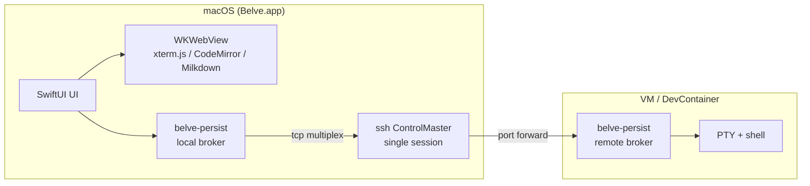

<p align="center">
  <h1 align="center">Belve</h1>
  <p align="center">
    A native macOS workspace for multi-project SSH &amp; DevContainer development
  </p>
  <p align="center">
    
    
    
  </p>
  <p align="center">
    <a href="#features">Features</a> · <a href="#install">Install</a> · <a href="#quick-start">Quick Start</a> · <a href="#architecture">Architecture</a> · <a href="#docs">Docs</a>
  </p>
</p>

---

Belve is a single-window, native macOS app that brings **terminal, code editor, file tree, and Markdown WYSIWYG** together — across local, SSH, and DevContainer targets. Built in Swift / SwiftUI from the ground up. No Electron. One process.

## Why Belve?

Coding agents and remote dev make you juggle terminals across hosts, containers, and local dirs. Existing tools either lock you into one workflow (IDE + SSH plugin) or force Electron bloat. Belve sits in between: **one window, many projects, native speed**, and first-class support for agent session tracking.

### Pain points it removes

- **SSH `MaxSessions` exhaustion** — Belve multiplexes every pane over a single ControlMaster connection with dynamic port forwards.
- **Lost terminal state on disconnect** — `belve-persist` (Go) keeps the PTY alive on the remote so reconnects resume instantly.
- **Context-switching chaos** — Every project keeps its own terminals, editor, and file tree in isolated state.
- **Agent blindness** — Claude Code and Codex hooks are captured session-wide and surfaced in real time.

## Features

- 🧱 **Multi-project sidebar** — Independent state per project, smooth cross-project switching (`Cmd+[` / `Cmd+]`).
- 🔗 **Unified remote UX** — SSH / DevContainer / local folders, same interface.
- 🪢 **Single SSH connection, many panes** — ControlMaster + port forward multiplexing. No more `Session open refused`.
- 🧷 **Persistent sessions** — `belve-persist` holds PTYs across reconnects and app restarts.
- ⚡ **Fast terminal** — xterm.js in WKWebView. Pane splits, ANSI, link detection, scrollback.
- 📝 **Integrated editor** — CodeMirror 6 with syntax highlighting, diff gutter, file search.
- 🎨 **Markdown WYSIWYG** — Milkdown Crepe for inline `.md` editing.
- 🤖 **Agent session bar** — Claude Code / Codex hooks tracked live with tool, status, and activity per pane.

## Install

> Belve is not yet distributed as a prebuilt `.app`. Build from source below.

```bash
# Prerequisites: Xcode 15+, Node 18+, Go 1.21+
git clone https://github.com/shunyooo/belve.git
cd belve
npm install

./scripts/build-app.sh
open Belve.app
```

> **Important** — always launch via the `.app` bundle. Running the raw Swift binary prevents macOS from treating it as an app, which breaks keyboard input.

Clean build if SPM caches get stuck:

```bash
swift package clean && ./scripts/build-app.sh
```

## Quick Start

1. Launch Belve and create a project from the sidebar (or `Cmd+N`).
2. Point it at a local folder, an SSH host from your `~/.ssh/config`, or open in a DevContainer.
3. Split panes (`Cmd+D` vertical, `Cmd+Shift+D` horizontal). Run your agents, shells, or dev servers.
4. Open files from the file tree to drop them in the CodeMirror editor. `.md` opens in WYSIWYG mode.
5. Toggle the session bar with `Cmd+Shift+\` to watch live Claude Code / Codex activity across projects.

## Architecture



- **One SSH session per host** — every terminal pane rides the same port-forwarded TCP connection, multiplexed by `belve-persist`.
- **One process** — no renderer subprocesses, no Node runtime. Just Swift + WebKit + a Go sidecar for PTY persistence.

## Stack

| Layer            | Technology                                       |
| ---------------- | ------------------------------------------------ |
| App shell        | Swift / SwiftUI (macOS 14+)                      |
| Terminal         | xterm.js (WKWebView) + PTY via `posix_spawn`     |
| Editor           | CodeMirror 6 (WKWebView)                         |
| Markdown         | Milkdown Crepe (WKWebView)                       |
| Session persist  | `belve-persist` — Go, dtach-like                 |
| Remote transport | System `ssh` (ControlMaster + port forward)      |
| DevContainer     | `devcontainer` CLI                               |

## Docs

- [CLAUDE.md](CLAUDE.md) — project guide (build, test, conventions)
- [docs/architecture.md](docs/architecture.md) — architecture overview
- [docs/DESIGN.md](docs/DESIGN.md) — design principles
- [docs/development-guide.md](docs/development-guide.md) — developer workflow
- [docs/TODO.md](docs/TODO.md) — roadmap

## Versioning

- **v1.x** — Archived era when Belve was a VS Code (Electron) fork.
- **v2.0+** — Current Swift native implementation, rewritten from scratch.

## License

See [LICENSE](LICENSE).
